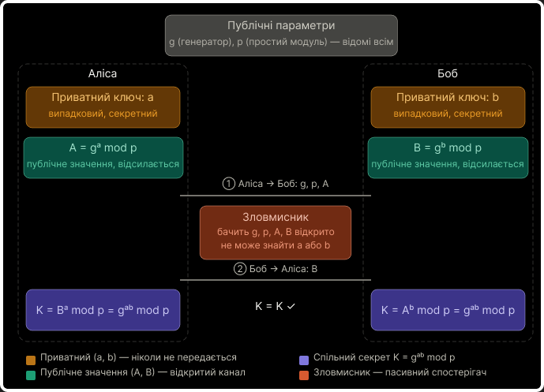

# Diffie-Hellman (UA)

## <mark style="color:$primary;">ЩО ЦЕ ТАКЕ</mark>

<mark style="color:red;">**Протокол Діффі-Хеллмана (DH)**</mark> — це не шифрування. Це <mark style="color:purple;">**протокол узгодження спільного секрету**</mark>. Двоє людей через відкритий канал, де все видно, домовляються про спільний ключ — і <mark style="color:orange;">**жоден перехоплювач цей ключ не отримає**</mark>.

Після того як ключ узгоджено, його використовують для симетричного шифрування (наприклад AES). DH сам нічого не шифрує — він вирішує задачу безпечної доставки ключа.

Придумали Вітфілд Діффі та Мартін Хеллман у 1976 році — за рік до публікації RSA.

## <mark style="color:$primary;">АЛГОРИТМ</mark>

1. Публічно домовляєтесь про два числа: просте `p` і генератор `g` (первісний корінь за mod p)
2. Аліса генерує приватний ключ `a` (випадковий, 2 ≤ a ≤ p−2)
3. Боб генерує приватний ключ `b` (випадковий, 2 ≤ b ≤ p−2)
4. Аліса рахує `A = g^a mod p` і відправляє Бобу
5. Боб рахує `B = g^b mod p` і відправляє Алісі
6. Аліса рахує `K = B^a mod p`
7. Боб рахує `K = A^b mod p`
8. Обидва отримали однаковий `K = g^(ab) mod p` — це і є спільний ключ

```bash
Відкрито: g, p, A, B
Секретно: a, b, K
```

<figure><figcaption></figcaption></figure>

## <mark style="color:$primary;">МАТЕМАТИКА</mark>

#### <mark style="color:yellow;">Чому K збігається</mark>

Це чиста властивість степенів:

$$K = B^a \bmod p = (g^b)^a \bmod p = g^{ab} \bmod p$$

$$K = A^b \bmod p = (g^a)^b \bmod p = g^{ab} \bmod p$$

Результат однаковий бо `(g^b)^a = (g^a)^b = g^(ab)`. Порядок піднесення до степеня не має значення.

### <mark style="color:green;">Криптостійкість — задача дискретного логарифму</mark>

Перехоплювач бачить `g`, `p`, `A`, `B`. Щоб отримати `K` йому треба знайти або `a` з `A = g^a mod p`, або `b` з `B = g^b mod p`.

Ця задача називається <mark style="color:yellow;">**задачею дискретного логарифму**</mark> — аналог факторизації з RSA. В одну сторону рахується миттєво, у зворотну — практично неможливо.


В RSA пасткова операція — множення двох великих простих (факторизація). В DH — модульне піднесення до степеня (дискретний логарифм). Принцип той самий: в одну сторону дешево, у зворотну — нескінченно дорого.


При `p` розміром 2048+ біт перебір усіх можливих `a` займе надзвичайно багато часу.

### <mark style="color:green;">Первісний корінь і чому він важливий</mark>

`g` повинне бути **первісним коренем за модулем p** — тобто його степені `g^1, g^2, ..., g^(p-1)` мають породжувати всі числа від 1 до p−1.

Наприклад, `p = 7`, `g = 3`:

```bash
3^1 mod 7 = 3
3^2 mod 7 = 2
3^3 mod 7 = 6
3^4 mod 7 = 4
3^5 mod 7 = 5
3^6 mod 7 = 1  ← повний цикл, всі числа 1..6 охоплено
```

Якщо `g` не є первісним коренем — його степені покривають лише частину можливих значень, простір ключів `K` стає малим і перебір стає реальним.


Нагадування з RSA: первісний корінь — це число, порядок якого рівно `p−1`. Воно проходить увесь цикл Ейлера не зациклюючись раніше.


### <mark style="color:green;">Forward Secrecy — головна перевага над RSA</mark>

RSA шифрує одним довготривалим приватним ключем. Якщо через рік цей ключ витече — **весь записаний раніше трафік можна розшифрувати.**

DH генерує нові `a` і `b` для <mark style="color:yellow;">**кожної сесії**</mark> і одразу знищує їх після отримання `K`. Навіть маючи всі ключі — старий трафік не розшифрувати, бо `a` і `b` вже не існують. Це і є **forward secrecy**.

## <mark style="color:$primary;">СЛАБКЕ МІСЦЕ — MitM</mark>

Базовий DH не автентифікує учасників. Якщо між Алісою і Бобом сидить Єва:

```bash
Аліса ←→ Єва ←→ Боб
```

Єва встановлює окремий DH з Алісою і окремий з Бобом. Обидва думають що говорять один з одним. Математика ідеальна — але вона не говорить тобі **хто** надіслав `B`.


Тому DH у чистому вигляді не використовується. У TLS він комбінується з цифровими підписами (RSA або ECDSA) — щоб довести що публічне значення справді від легітимної сторони.

