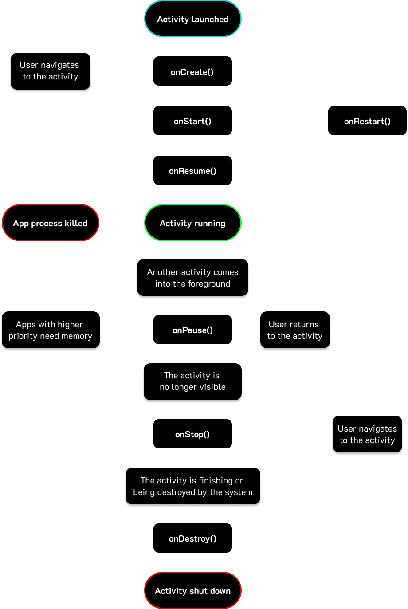

# Android Applications

## <mark style="color:$primary;">ABOUT</mark>

## <mark style="color:blue;">Project Structure</mark>

#### app/

| File                                            | Description                                                                                   |
| ----------------------------------------------- | --------------------------------------------------------------------------------------------- |
| <mark style="color:$success;">`manifest`</mark> | Package name, components (activities, services, etc.), permissions, network config, API level |
| <mark style="color:$success;">`java`</mark>     | Application Java source code                                                                  |
| <mark style="color:$success;">`res`</mark>      | UI strings, images, layout XMLs, static assets                                                |

#### Gradle Scripts

| File                                                      | Description                                               |
| --------------------------------------------------------- | --------------------------------------------------------- |
| <mark style="color:$success;">`build.gradle`</mark>       | Build config — dependencies, build types, ProGuard toggle |
| <mark style="color:$success;">`proguard-rules.pro`</mark> | Custom ProGuard rules                                     |

### <mark style="color:blue;">activity\_main.xml</mark>

| Attribute                                                            | Description                                                                                                            |
| -------------------------------------------------------------------- | ---------------------------------------------------------------------------------------------------------------------- |
| <mark style="color:$success;">`tools:context=".MainActivity"`</mark> | Binds layout to Activity in editor preview only. No runtime effect.                                                    |
| <mark style="color:$success;">`android:id`</mark>                    | Unique identifier for referencing in Java. `@+id` creates new resource; `@id` references existing.                     |
| <mark style="color:$success;">`android:text`</mark>                  | Text content of TextView/Button. Hardcoded or referenced from `res/values/strings.xml` (recommended for localization). |

HTML/JS files → `app/assets` (`app/src/main/assets` in Project view).

## <mark style="color:$primary;">APPLICATION COMPONENTS</mark>

Building blocks that define different parts of an Android app — UI, background logic, data access, and event handling. All components must be declared in `AndroidManifest.xml` to be recognized by the system. They can be used individually or in combination.

Components communicate with each other — both within the same app and across different apps — via **IPC** **(Interprocess Communication)**. This is what allows, for example, one app to trigger an action in another, or separate processes within the same app to exchange data.

Main components: Activities, Services, Broadcast Receivers, Content Providers.

### <mark style="color:$primary;">Activities</mark>

Single screen with a UI. Can appear as full-screen, floating, embedded, or multi-window.

<figure><figcaption></figcaption></figure>

#### <mark style="color:purple;">Lifecycle Callbacks</mark>

| Callback                                           | What happens                                                                                                                                                                                                    |
| -------------------------------------------------- | --------------------------------------------------------------------------------------------------------------------------------------------------------------------------------------------------------------- |
| <mark style="color:$success;">`onCreate()`</mark>  | Activity created. UI setup, data binding, listener config. **Key pentest entry point** — hard-coded credentials/keys often initialized here; Intent parameters passed between activities are also handled here. |
| <mark style="color:$success;">`onStart()`</mark>   | Activity becomes visible to user. Resource initialization.                                                                                                                                                      |
| <mark style="color:$success;">`onResume()`</mark>  | Activity interacting with user. Animations, media, input handling. Always followed by `onPause()`.                                                                                                              |
| <mark style="color:$success;">`onPause()`</mark>   | Another app or dialog is on top. Activity still visible, non-needed resources released. Followed by `onResume()` or `onStop()`.                                                                                 |
| <mark style="color:$success;">`onStop()`</mark>    | Activity no longer visible. Resources released. Followed by `onRestart()` or `onDestroy()`.                                                                                                                     |
| <mark style="color:$success;">`onDestroy()`</mark> | Activity destroyed — system needs memory or user closed it.                                                                                                                                                     |
| <mark style="color:$success;">`onRestart()`</mark> | Called when activity restarts after `onStop()`. Followed by `onStart()`.                                                                                                                                        |

Android maintains an **Activity stack** per task. New Activity → pushed on top → becomes active. Back navigation → popped from stack.

#### <mark style="color:purple;">Declaring Activities</mark>

Must be declared in `AndroidManifest.xml` as child of `<application>`:

```xml
<activity android:name=".MainActivity">
    <intent-filter>
        <action android:name="android.intent.action.MAIN" />
        <category android:name="android.intent.category.LAUNCHER" />
    </intent-filter>
</activity>
```

`android.intent.action.MAIN` marks the entry point of the app — first Activity launched on start. Entry point identification is a priority during pentesting (maps attack surface and app flow).

#### <mark style="color:purple;">Intents</mark>

Messaging objects used to request an action from another component (same or other app).

## <mark style="color:$primary;">SERVICES</mark>

An Android component that performs long-running operations in the background without a user interface. The key point is that a Service continues running even after the user has left the app — it is not tied to the Activity lifecycle. Used for tasks like downloading files, playing music, or maintaining a connection to a remote server.

There are three types:

| Type           | Description                                                                                                                                                                                                                               |
| -------------- | ----------------------------------------------------------------------------------------------------------------------------------------------------------------------------------------------------------------------------------------- |
| **Foreground** | Requires user attention. Must show a persistent notification so the user is aware it's running. Continues even when app is minimized. Started with `startService()`. Examples: media players, navigation apps.                            |
| **Background** | Performs work that doesn't need user awareness. Android 8.0+ (API 26): restricted from running unless the app is in the foreground — introduced to conserve battery and system resources.                                                 |
| **Bound**      | Other components (even from different processes) bind to it via `bindService()`. Provides a client-server interface for IPC — client can invoke methods and receive results. Connection lasts as long as at least one component is bound. |

```java
public class ExampleService extends Service {
    int startMode;       // behavior if service is killed
    IBinder binder;      // interface for bound clients
    boolean allowRebind; // whether onRebind should be used
}
```

### <mark style="color:blue;">Broadcast Receivers</mark>

Serve two roles simultaneously: an Application Component and an IPC mechanism.

As an <mark style="color:$danger;">**IPC mechanism**</mark> — <mark style="color:purple;">**enable communication between different applications by sending and receiving Intents**</mark>. These Intents can come from the Android system, other apps, or the app itself.

As an <mark style="color:$danger;">**Application Component**</mark> — <mark style="color:purple;">**designed to respond to system-wide or custom events**</mark>. Act as a messaging system across the entire Android ecosystem. For example, the system broadcasts an event when the device starts charging, and any app with a registered receiver for that event will be notified.

Broadcast Receivers do not have a UI and are not long-running — `onReceive()` is called and expected to finish quickly.

```java
public class MyBroadcastReceiver extends BroadcastReceiver {
    @Override
    public void onReceive(Context context, Intent intent) {
        String action = intent.getAction();
        if (action != null) {
            switch (action) {
                case Intent.ACTION_POWER_CONNECTED:    break;
                case Intent.ACTION_POWER_DISCONNECTED: break;
                default: break;
            }
        }
    }
}
```

| Method                                                                      | Description                                            |
| --------------------------------------------------------------------------- | ------------------------------------------------------ |
| <mark style="color:$success;">`sendBroadcast(Intent)`</mark>                | Sends to all receivers simultaneously, undefined order |
| <mark style="color:$success;">`sendOrderedBroadcast(Intent, String)`</mark> | Sends to one receiver at a time, in priority order     |

### <mark style="color:blue;">Content Providers</mark>

Serve two roles simultaneously: an Application Component and an IPC mechanism.

As an <mark style="color:$danger;">**IPC mechanism**</mark> — <mark style="color:purple;">**enable communication between apps**</mark> by allowing them to access, modify, or delete data through a consistent interface via the `ContentResolver` class.

As an <mark style="color:$danger;">**Application Component**</mark> — <mark style="color:purple;">**responsible for managing and exposing structured data**</mark>, either within the same app or to external apps. Act as an intermediate layer between the app and its underlying data storage.

Data can be stored in: local SQLite databases, internal/external device storage, or a remote server. All interaction goes through a standardized **CRUD** (Create, Read, Update, Delete) API, regardless of the storage backend — this is what makes Content Providers a clean abstraction for data sharing across process boundaries.

## <mark style="color:$primary;">IPC — Application Level</mark>

High-level Java abstractions built on top of the Binder driver. They define the logic and format of interaction — the actual data transfer is delegated to Binder underneath.

### <mark style="color:blue;">Intents (Point-to-Point)</mark>

Directed message passing. A single, isolated data packet sent to activate a specific component (Activity or Service). An Intent is an object — it carries an action string, a target component (optional), a URI describing the data, extras (key-value pairs), and flags that modify how the OS handles it. Two types:

* <mark style="color:red;">**Explicit Intent**</mark> — targets a specific component by fully qualified class name (`com.example.app/.TargetActivity`). The OS delivers it directly, no resolution needed. Used within the same app — you know exactly what you're launching.
* <mark style="color:red;">**Implicit Intent**</mark> — declares an action (`VIEW`, `SEND`, `DIAL`, etc.) and optionally a data URI or MIME type, but no target component. The OS queries all installed apps for a matching `<intent-filter>` in their manifests and presents a chooser if multiple matches exist. If only one app matches, it gets the Intent silently.

<mark style="color:purple;">**Examples:**</mark>

* Tapping "Share" in a photo app → implicit Intent with action `SEND` and MIME `image/jpeg` → OS resolves to WhatsApp, Gmail, Telegram, etc.
* Banking app navigating from login screen to dashboard → explicit Intent targeting `DashboardActivity` directly
* Clicking a link in Gmail → implicit Intent with action `VIEW` and a `https://` URI → OS resolves to the default browser
* Payment app launching a PIN entry screen and waiting for the result → `startActivityForResult()` with an explicit Intent

### <mark style="color:blue;">Deep Links (External Trigger)</mark>

URL-based routing mechanism that causes the OS to generate an implicit Intent from an external source and route it into a specific app. The app registers a custom URI scheme (`myapp://`) or an `https://` domain pattern in its manifest via `<intent-filter>`. When that URL is opened from a browser or another app, the OS matches it and delivers it as a regular Intent — the receiving Activity handles it exactly like any other incoming Intent.

<mark style="color:purple;">**Examples:**</mark>

* `twitter://user?id=123` opened from a browser → OS generates Intent → Twitter app opens the profile directly
* Password reset link (`myapp://reset?token=abc123`) clicked in an email → app opens the reset screen with the token pre-loaded via `getIntent().getData()`
* Spotify `spotify://track/3n3Ppam7vgaVa1iaRUIOKE` → opens a specific song directly

Attack vectors: parameter manipulation (passing unexpected values in extras or URI params), authentication bypass (deep link skips login gate), XSS if the URI data is rendered in a WebView without sanitization, task hijacking if the target Activity has a misconfigured `launchMode`.

### <mark style="color:blue;">Broadcast Receivers (Publish / Subscribe)</mark>

Global or local event broadcasting. A process emits a message into the system by sending an Intent — but unlike point-to-point Intents, there is no single target. Instead, the OS delivers the message to every component that has registered interest in that action, either statically (in the manifest) or dynamically (via `registerReceiver()` at runtime). Receivers that registered dynamically only receive broadcasts while the app is running; static receivers can be woken up by the system even if the app isn't running.

* <mark style="color:red;">**Global broadcast**</mark> — system-wide. Any app with the matching `<intent-filter>` receives it. Can be protected by requiring a permission to send or receive.
* <mark style="color:red;">**Local broadcast**</mark> (`LocalBroadcastManager`) — scoped to the same app process. Not visible to other apps, not mediated by Binder — uses an in-process event bus. Faster and no cross-app exposure.

<mark style="color:purple;">**Examples:**</mark>

* System broadcasts `ACTION_BATTERY_LOW` → every app registered for it (battery savers, sync managers) receives notification simultaneously
* Music player app finishes downloading a song → sends a local broadcast → UI Activity updates the playlist without needing to poll
* `ACTION_BOOT_COMPLETED` broadcast at device startup → malware classic: register a static receiver for this action, get silently started every reboot
* SMS app receives `SMS_RECEIVED` broadcast → ordered broadcast, high-priority receivers can intercept and abort it before the default SMS app sees it (`sendOrderedBroadcast`)

### <mark style="color:blue;">Content Providers (Data Export / CRUD)</mark>

Expose structured data from one app to others through a standardized URI interface (`content://authority/path/id`). The requesting app never directly accesses the underlying storage — it calls `ContentResolver` methods, which go through Binder to the provider process. The provider executes the query against its SQLite database (or file, or network) and returns a `Cursor` object with the results.

Access is controlled at two levels: a `READ_URI_PERMISSION` / `WRITE_URI_PERMISSION` can be required for the whole provider, and individual URI paths can have separate permission requirements. Providers can also grant temporary URI permissions to other apps without them holding the permanent permission.

All operations map to CRUD:

| Method                                          | SQL equivalent                                |
| ----------------------------------------------- | --------------------------------------------- |
| <mark style="color:$success;">`query()`</mark>  | <mark style="color:$success;">`SELECT`</mark> |
| <mark style="color:$success;">`insert()`</mark> | <mark style="color:$success;">`INSERT`</mark> |
| <mark style="color:$success;">`update()`</mark> | <mark style="color:$success;">`UPDATE`</mark> |
| <mark style="color:$success;">`delete()`</mark> | <mark style="color:$success;">`DELETE`</mark> |

<mark style="color:purple;">**Examples:**</mark>

* Contacts app exposes all contact data via `content://com.android.contacts/contacts` → any app with `READ_CONTACTS` permission can query it
* Gallery app exposes photos via `MediaStore` Content Provider → third-party editors request specific image URIs without needing broad storage access
* A messaging app stores chat history in SQLite and exposes it through a Content Provider → backup app reads message history via `ContentResolver.query()`
* Misconfigured provider with `exported="true"` and no permission requirement → any installed app can query, insert, or delete its data

### <mark style="color:blue;">Bound Services / AIDL (Remote Procedure Call)</mark>

Persistent, bidirectional connection between processes. Unlike an Intent which delivers a message and ends, a bound connection stays open — the client holds a reference to the Service's interface and can call methods on it repeatedly, synchronously, as if the code were local.

The flow: the client calls `bindService()` with an Intent identifying the target Service. The OS starts the Service (if not running) and calls its `onBind()`, which returns an `IBinder` object — the interface the client will call through. The client receives this in `onServiceConnected()` and casts it to the AIDL-generated interface to start making calls.

<mark style="color:$danger;">**AIDL (Android Interface Definition Language)**</mark> is the contract definition layer. The developer writes an `.aidl` file declaring the methods and parameter types. The build system generates the Java stub and proxy classes that handle serialization into Parcels on both sides. Without AIDL, cross-process method calls would require manually serializing and deserializing every argument — AIDL automates this.

The connection stays alive as long as at least one client is bound. When all clients unbind, the OS calls `onUnbind()` and may destroy the Service.

<mark style="color:purple;">**Examples:**</mark>

* Music player: UI Activity binds to a `MusicService` → calls `play()`, `pause()`, `seekTo()` directly on the service interface while music continues in the background
* Google Play Services: apps bind to `GoogleApiClient` service to access Maps, Auth, or Location APIs — all cross-process via AIDL
* A DRM service exposing media decryption functions to a media player app via a bound interface — the keys never leave the service process
* Payment terminal app: merchant UI binds to a card reader Service, calls `readCard()` and `processPayment()` as if local, while the hardware communication happens in the isolated service process
